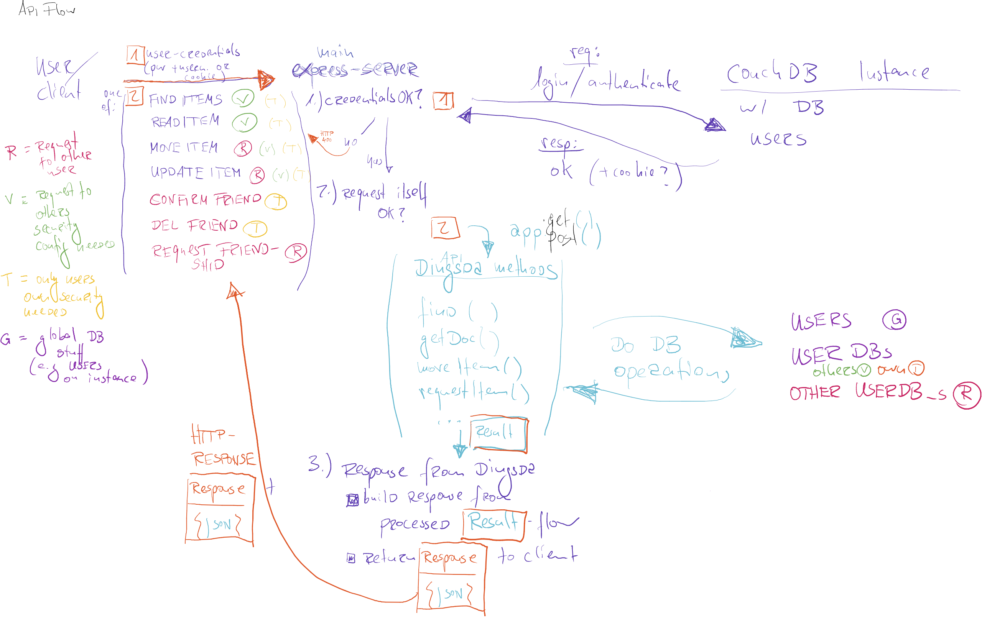
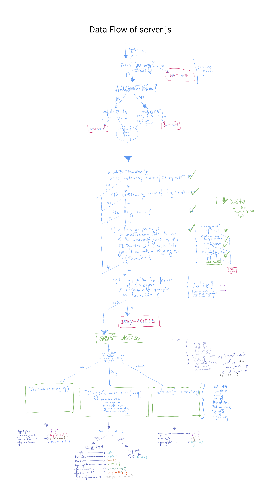

# dingsda

dingsda - ze internez of dings

https://www.dingsda.org

## API v0.1 ##





| Name | URI | HTTP Method | HTTP Header | POST body | URI params | Result | done | priority | handled by |
|-----------------|-----------------------|-------------|-------------|----------------------------------------------------------------------------------------------------------------------------------------------------------------------------------------------------------------------------------------------------------------------|------------------------------------------------------------------------------|------------------------------------------------------------------------------------------------------------------------------------------------------------------------------------------------------------------------|------|----------|----------------------|
| Auth POST | api/v1/ | POST |  | {username:xxx, password:xxx} |  | {"ok": "true"} + cookie w/ AuthSession | YES |  | server.js middleware |
| Auth GET | api/v1/ | GET |  |  | name & passwordORjson = {"username":"xxx", "password":"xxx"} | {"ok": "true"} + cookie w/ AuthSession | YES |  | server.js middleware |
| REGISTER | api/v1/register | POST |  | {username:xxx, password:xxx} |  | ok + referrer to loginpage or API after verification of human or error. Request a userName and password and thereby an account with 1 DB under control of this user | NO | MEDIUM | instanceCommander() |
|  |  |  |  |  |  |  |  |  |  |
| GET ITEM | api/v1/:userDB:itemId | GET | cookie |  | IF NO COOKIE: name & passwordOR json = {"username":"xxx" , "password":"xxx"} | Show details of an item, if allowed by owner of item (returns not existing if any concerns arise) | YES |  | dingsCommander() |
| MOVE ITEM | api/v1/:userDB:itemId | POST |  | {   "data": [{       "type": "move",       "location": xxxx}]} |  | updates location of a thing if requesting user is defined as mover in ownerDBs _security | YES |  | dingsCommander() |
| UPDATE ITEM | api/v1/:userDB:itemId | POST |  | {   "data": [{       "type": "update",       "doc": {newdoc incl. last _rev}]} |  | updates complete object if correct _rev is provided and requesting user is listed as editor in ownerDBs _security. Careful!: this means FULL writing permissions for this object excluding only owners, id and name!!! | YES |  | dingsCommander() |
|  |  |  |  |  |  |  |  |  |  |
| DELETE ITEM(S) | api/v1/:userDB | POST | cookie | JSON String |  | Delete an existing item from your DBs. | NO | MEDIUM | DBCommander() |
| FIND ITEM(S) | api/v1/:userDB | POST | cookie | {   "data": [{       "type": "find",       "doc": {document parameters to search in: and their keys. inside of keys regex is ok.}],       "bookmark": <String, optional use of watermark if last query was paginated and you need more results from the same query)} |  | Show list of all itemIds, names and location, matching search queries parameters and $regex((?i) (regex style: PCRE) (paginated after 50 items with couchDB watermark) | NO | HIGH | DBCommander() |
| ADD ITEM(S) | api/v1/:userDB/ | POST | cookie | {   "data": [{       "type": "addItems",       "doc": {newdoc}]} |  | Add new item to your own DBs (tbd: multiple items) | NO | HIGH | DBCommander() |
| REQUEST ITEM(S) | api/v1/:userDB | POST | cookie | JSON String |  | Send itemRequest to all owners of the item | NO | HIGH | DBCommander() |
|  | api/v1/findItems | GET / POST | cookie | JSON String |  | Show list of all itemIds matching search Query (might be paginated if POST) | NO | LOW | instanceCommander() |
|  | api/v1/addItems | POST | cookie | JSON String |  | Add details of new item(s) to DBs that list you in editor or admin group | NO | LOW | instanceCommander() |
|  | api/v1/deleteItems | DELETE | cookie | JSON String |  | Delete existing item(s) that list you as owner in DBs that allow you access | NO | LOW | instanceCommander() |
|  |  |  |  |  |  |  |  |  | instanceCommander() |
|  | api/v1/public/:itemId | GET / POST |  |  |  | Show details of an item, if publicly visible item (for non publicly visible items you will have to know who is the owner) | NO | LOW | instanceCommander() |


(table made with: https://www.tablesgenerator.com/markdown_tables)


## json schema (work in progress) ##

explanation needed for:
  - location either string (then: constraint free because only for humans anyhow)
   or object (than one of two constraints) are valid and force longitude and latitude via pattern
   or the field "inside_id" to mark in which other item it can be found
  - other contains everything that is not absolutely needed for the simplest bare bone item (that includes: barcodes, prices, sizes, availablity etc.)

```
{
  "$id": "https://dingsda.org/api/v1/item.json",
  "description": "Schema for an item within dingsda.org DB. Describes a thing in as minimal terms as possible",
  "definitions": {
    "location": {
      "type": "object",
      "description": "minimal requirements for a location object.",
      "properties": {
        "name": {
          "type": "string"
        },
        "longitude": {
          "type": "string",
          "pattern": "^(\\+|-)?(?:180(?:(?:\\.0{1,6})?)|(?:[0-9]|[1-9][0-9]|1[0-7][0-9])(?:(?:\\.[0-9]{1,6})?))$"
        },
        "latitude": {
          "type": "string",
          "pattern": "^(\\+|-)?(?:90(?:(?:\\.0{1,6})?)|(?:[0-9]|[1-8][0-9])(?:(?:\\.[0-9]{1,6})?))$"
        }
      },
      "required": [
        "name",
        "longitude",
        "latitude"
      ]
    },
    "obj_in_obj": {
      "type": "object",
      "properties": {
        "inside_id": {
          "type": "string"
        }
      },
      "required": [
        "inside_id"
      ]
    }
  },
  "type": "object",
  "properties": {
    "_id": {
      "type": "string",
      "description": "unique ID to identify item."
    },
    "name": {
      "type": "string",
      "description": "human readable name"
    },
    "location": {
      "type": [
        "string",
        "object"
      ],
      "oneOf": [
        {
          "$ref": "#/definitions/location"
        },
        {
          "$ref": "#/definitions/obj_in_obj"
        },
        {
          "type": "string"
        }
      ],
      "description": "physical location of the object at the moment. either string describing location or object following location definition."
    },
    "owners": {
      "type": [
        "string",
        "array"
      ]
    },
    "other": {
      "$id": "/properties/other",
      "type": "object",
      "properties": {
        "price": {
          "$id": "/properties/other/properties/price",
          "type": "string",
          "title": "The Price Schema "
        },
        "visibility": {
          "$id": "/properties/other/properties/visibility",
          "type": [
            "string",
            "array"
          ]
          "title": "Read Rights for this item",
          "description": "needs to be either keywords 'private', 'public' or an Array of groups listed in _security of owners DB"
        }
      }
    }
  },
  "required": [
    "_id",
    "name",
    "location",
    "owners"
  ]
}
```

this simple example would pass validation:

```
{
	"_id":"1",
    "name":"eins",
	"location":{"name":"berlin","longitude":"52.51704","latitude":"13.38792"},
    "owner":["e8edb946-3df0-57fd-afd7-07b5a7ac4d0d","77827d81-b80d-543f-967d-c81be310c999"],
    "other":{}
}
```
